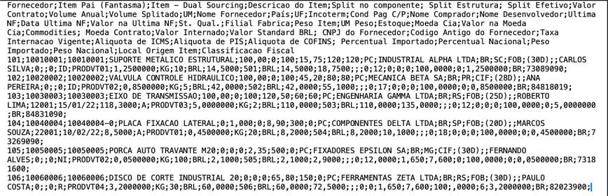
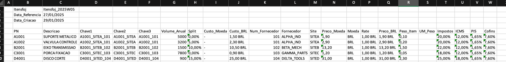

# Relatórios Semanais Automatizados de Custos - Projeto Legado (2020)

🌐 Idioma: Português | [English](README.md)

> Projeto legado de portfólio, originalmente desenvolvido em 2020.  
> Documentação em português.

---

## Visão Geral

Este foi o primeiro projeto de automação que desenvolvi utilizando Python, originalmente em 2020.

O objetivo era eliminar um processo totalmente manual e repetitivo de geração de relatórios semanais em Excel para análise de itens comprados, volumes, fornecedores e custos.

Embora fosse uma automação simples em comparação com soluções mais recentes, este projeto resolveu um problema real de negócio e marcou o início da minha transição para desenvolvimento de software, automação de processos e análise de dados aplicada à redução de custos.

---

## Contexto do Problema

Na época, o processo de geração dos relatórios semanais exigia diversas etapas manuais, incluindo:

- Identificação manual de relatórios semanais ausentes;
- Coleta de múltiplos arquivos `.txt` utilizados como fontes de dados;
- Extração e consolidação manual dos dados em Excel;
- Uso parcial de macros para apoiar algumas etapas do processo;
- Realização de cálculos de custo e conversões de moeda;
- Padronização de informações de fornecedores;
- Criação de novos relatórios semanais com base em modelos e regras predefinidas.

Esse processo era demorado, repetitivo, sujeito a erros e pouco escalável.

---

## Solução

Desenvolvi um script em Python para automatizar o fluxo completo de geração dos relatórios.

A automação era responsável por:

- Verificar diretórios históricos para identificar relatórios semanais ausentes;
- Ler e processar arquivos `.txt` brutos;
- Extrair e transformar os dados relevantes;
- Realizar cálculos de custo;
- Consolidar volumes de compra;
- Aplicar regras de conversão de moeda;
- Agrupar dados de diferentes unidades da empresa;
- Padronizar informações de fornecedores;
- Gerar relatórios estruturados em Excel (`.xlsx`) utilizando um modelo predefinido.

---

## Principais Funcionalidades

- Detecção automática de relatórios semanais faltantes;
- Leitura e interpretação de arquivos `.txt` semiestruturados;
- Aplicação de regras de negócio para cálculos de custo e volume;
- Geração de relatórios Excel com estrutura e formatação padronizadas;
- Normalização de dados de fornecedores;
- Processamento em lote para múltiplas semanas;
- Execução via linha de comando.

---

## Tecnologias Utilizadas

- Python 3.x;
- openpyxl;
- Automação de sistema de arquivos;
- os;
- shutil;
- Modelos de planilhas Excel;
- Execução via CLI.

---

## Impacto

Esta automação gerou impacto operacional direto no processo:

- Reduziu o tempo de geração dos relatórios de aproximadamente 4 horas para cerca de 5 minutos;
- Eliminou trabalho manual repetitivo;
- Melhorou a consistência dos relatórios gerados;
- Reduziu o risco de erros manuais;
- Aumentou a confiabilidade das informações processadas;
- Criou uma base para futuras iniciativas de automação;
- Abriu caminho para que o processo pudesse evoluir para uma execução totalmente automática, realizada semanalmente sem intervenção humana.

---

## Contexto Legado e Limitações

Este projeto é mantido como uma referência legada e reflete meu nível técnico no período em que foi desenvolvido.

Algumas limitações da implementação original incluíam:

- Caminhos de arquivos fixos, configurados para ambiente Windows;
- Ausência de estrutura modular;
- Tratamento de erros limitado;
- Ausência de interface gráfica;
- Execução apenas via linha de comando.

Essas limitações são documentadas intencionalmente para demonstrar a evolução das minhas habilidades técnicas ao longo do tempo.

---

## Evolução

Este projeto serviu como base para soluções mais avançadas envolvendo:

- Pipelines de processamento de dados;
- Sistemas automatizados de análise de custos;
- Análises de redução de custos;
- Análises de cost avoidance;
- Processamento de dados estruturados de maior qualidade;
- Apoio à tomada de decisão com base em dados confiáveis.

---

## Observações

Este projeto utiliza dados anonimizados e lógica simplificada para fins de demonstração.

O repositório é mantido como um projeto legado de portfólio, demonstrando o início da minha jornada em desenvolvimento de software e automação, além da busca contínua por soluções técnicas melhores por meio de uma mentalidade orientada à resolução de problemas.

---

## Exemplo de Arquivo de Entrada

Arquivo `.txt` anonimizado utilizado como entrada:

---

## Exemplo de Arquivo de Saída

Relatório `.xlsx` anonimizado gerado pela automação:

